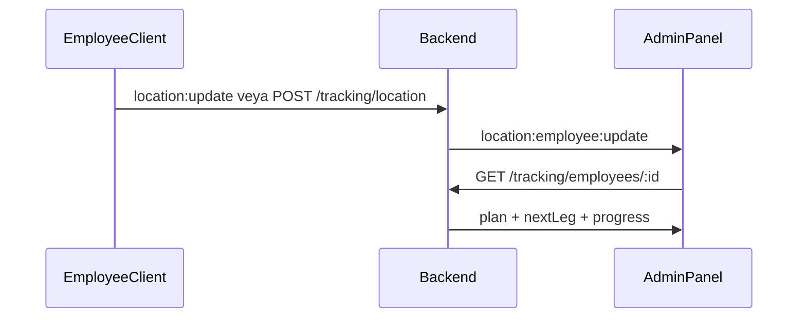

# E-Atık Backend API Dokümantasyonu

Node.js + Express + Prisma + PostgreSQL tabanlı E-Atık kampüs atık yönetimi backend uygulaması.

**Base URL:** `http://localhost:2001` (veya `.env` içindeki `PORT`)

Tüm API istekleri: `http://localhost:2001/api/...`

**Socket (canlı konum):** `http://localhost:2001` — path `/socket.io/` (`/api` öneki yok)

### Son özellikler (özet)

- **Çalışan Durumları** (`/admin/employee-status`): ADMIN/BOSS için canlı harita, çalışan listesi, kalan iş ve sonraki rota adımı
- **Konum takibi API:** `GET/POST /api/tracking/*` + Socket.IO `location:update` (mobil/web `EMPLOYEE` gönderir)
- **Rota ilerlemesi:** `GET/PUT /api/employee/route-progress` — admin panelinde ilerleme görünürlüğü

---

## İçindekiler

- [Kurulum](#kurulum)
- [Ortam değişkenleri](#ortam-değişkenleri)
- [Demo hesaplar](#demo-hesaplar)
- [Ortak kurallar](#ortak-kurallar)
- [Enum referansı](#enum-referansı)
- [Henüz API olmayan modeller](#henüz-api-olmayan-modeller)
- [API referansı](#api-referansı)
  - [Sistem](#sistem)
  - [Kimlik doğrulama (Auth)](#kimlik-doğrulama-auth)
  - [Kullanıcılar (Users)](#kullanıcılar-users)
  - [Bölgeler (Regions)](#bölgeler-regions)
  - [Çöp kovaları (Bins)](#çöp-kovaları-bins)
  - [İstatistikler (Stats)](#istatistikler-stats)
  - [Atık talepleri (Waste requests)](#atık-talepleri-waste-requests)
  - [Çalışan rotası (Employee)](#çalışan-rotası-employee) — `route-plan`, `route-leg`, `route-progress`, `region-bins`, `region-alerts`
  - [Konum takibi (Tracking)](#konum-takibi-tracking) — `employees`, `employees/:id`, `location`
- [Web arayüzü](#web-arayüzü)
  - [Çalışan Durumları (Admin / BOSS)](#çalışan-durumları-admin--boss)
- [Socket.io](#socketio)
- [İş kuralları](#iş-kuralları)

---

## Kurulum

### Docker ile çalıştırma

1. `Backend` klasöründe ortam dosyasını oluşturun:
   - Linux/macOS: `cp .env.example .env`
   - Windows: `.env.example` dosyasını `.env` olarak kopyalayın
2. Gerekirse `.env` içindeki `DB_USER`, `DB_PASSWORD`, `DB_NAME` ve JWT anahtarlarını düzenleyin.
3. Stack'i başlatın: `docker compose up --build`
4. Uygulama: `http://localhost:2001/` (tanıtım), panel: `http://localhost:2001/dashboard`

İlk kurulumda veya veritabanı volume'u bozulduysa (geliştirme ortamı):

```bash
docker compose down -v
docker compose up --build
```

`-v` postgres volume'unu siler; yerel geliştirme verisi kaybolur.

**Sorun giderme:** Log'da `role "-d" does not exist` görürseniz `.env` dosyası eksiktir veya `DB_USER` boş kalmıştır. `.env.example` içeriğini `.env` olarak kopyalayın.

Host'tan PostgreSQL'e bağlanmak için port: `localhost:5434` (container içi 5432).

### Yerel geliştirme (Docker olmadan)

```bash
npm install
cp .env.example .env   # DATABASE_URL'i yerel Postgres'e göre düzenleyin
npm run dev
```

`npm run dev` sırasıyla: bağımlılıklar, `prisma generate`, `prisma db push`, `prisma db seed`, ardından `nodemon` ile sunucuyu başlatır.

Manuel seed: `npx prisma db seed`

---

## Ortam değişkenleri

| Değişken | Açıklama | Varsayılan |
|----------|----------|------------|
| `PORT` | HTTP portu | `2001` |
| `DATABASE_URL` | PostgreSQL bağlantı dizesi | — |
| `DB_USER`, `DB_PASSWORD`, `DB_NAME` | Docker Compose için | — |
| `ACCESS_SECRET_KEY` | JWT access token imzası | — |
| `REFRESH_SECRET_KEY` | JWT refresh token imzası | — |
| `NODE_ENV` | `production` ise cookie `secure` | — |
| `SEED_PASSWORD` | Demo kullanıcı şifresi | `password` |
| `SEED_DEMO_USERS` | Production'da demo seed (`true`) | kapalı |
| `ROUTE_DEMO_START_LAT` | Rota demo başlangıç enlemi | `38.458919` |
| `ROUTE_DEMO_START_LNG` | Rota demo başlangıç boylamı | `27.227533` |
| `OSRM_URL` | OSRM yol servisi | `https://router.project-osrm.org` |
| `OSRM_TIMEOUT_MS` | OSRM istek zaman aşımı (ms) | `15000` |
| `SOCKET_CORS_ORIGIN` | Socket.IO CORS kökeni (`*` geliştirme; production'da kısıtlayın) | `*` |
| `ROUTE_MIN_FULLNESS` | Rota aday eşiği | `0.05` |
| `ROUTE_RELATIVE_TOP_N` | Göreli rota üst-N | `5` |
| `ROUTE_RELATIVE_MIN` | Göreli rota minimum doluluk | `0.02` |
| `FULLNESS_POLL_INTERVAL_MS` | Doluluk socket yayın aralığı | `60000` |

**URL notu:** REST → `http://<HOST>:<PORT>/api` · Socket → `http://<HOST>:<PORT>` (ör. `http://localhost:2001`)

---

## Demo hesaplar

Docker veya `npm run dev` ile uygulama başlarken `npx prisma db seed` otomatik çalışır (bölgeler + demo kullanıcılar). **Yalnızca geliştirme ortamı içindir** — varsayılan şifreleri production'da kullanmayın.

| Rol | E-posta | Şifre | Not |
|-----|---------|-------|-----|
| ADMIN | `admin@info.com` | `password` | Çalışan Durumları, atık talepleri yönetimi |
| BOSS | `huseyinn.sayim@gmail.com` | `password` | Çöp kovası yönetimi, Çalışan Durumları (canlı harita) |
| USER | `user@info.com` | `password` | Son kullanıcı, atık talebi |
| EMPLOYEE | `employee@info.com` | `password` | Çöp toplayıcı (`TRASH_COLLECTOR`), KYK bölgesine atanır |

Şifreyi değiştirmek için: `SEED_PASSWORD`. Production'da demo kullanıcı seed'i varsayılan olarak kapalıdır; açmak için `SEED_DEMO_USERS=true` gerekir.

---

## Ortak kurallar

### Kimlik doğrulama

Giriş gerektiren isteklerde token iki yolla iletilir:

1. **Header:** `Authorization: Bearer <accessToken>`
2. **Cookie:** `accessToken` (httpOnly, login sonrası otomatik set edilir)

| Token | Süre | Nerede döner |
|-------|------|--------------|
| Access | 30 dakika | Login JSON + cookie |
| Refresh | 7 gün | Login JSON (veritabanında `RefreshToken` kaydı) |

### Standart hata yanıtları

| HTTP | Gövde örneği | Ne zaman |
|------|--------------|----------|
| `400` | `{ "message": "İsim alanı zorunludur." }` | Joi validasyon hatası |
| `401` | `{ "message": "Giriş yapınız" }` | Token yok |
| `401` | `{ "message": "Token geçersiz!" }` | Token süresi dolmuş / geçersiz |
| `403` | `{ "message": "Yetkisiz erişim!" }` | Rol yetersiz |
| `404` | `{ "message": "..." }` | Kayıt bulunamadı |
| `500` | `{ "message": "...", "error": "..." }` | Sunucu hatası |

### İstek formatı

- JSON body: `Content-Type: application/json`
- CORS: `*` (geliştirme); `OPTIONS` → `200`

---

## Enum referansı

| Enum | Değerler |
|------|----------|
| `Role` | `ADMIN`, `BOSS`, `EMPLOYEE`, `USER` |
| `EmployeeType` | `TRASH_COLLECTOR`, `WASTE_COLLECTOR` |
| `BinType` | `CONTAINER_LARGE`, `CONTAINER_SMALL`, `WASTE_POINT` |
| `WasteCategory` | `DOMESTIC`, `ELECTRONIC`, `PLASTIC`, `GLASS`, `PAPER`, `GENERAL` |
| `RequestStatus` | `PENDING`, `ON_ROUTE`, `COLLECTED`, `CANCELLED` |

---

## Henüz API olmayan modeller

Prisma şemasında tanımlı ancak REST endpoint'i **henüz yok:**

- `Wallet`, `Transaction` — cüzdan / coin işlemleri
- `Reward`, `Redemption` — ödül sistemi
- `ScannedQRCode` — QR tarama

Bu modeller için ileride endpoint eklenecektir.

---

## API referansı

---

### Sistem

#### `GET /api-health`

API'nin ayakta olduğunu kontrol eder.

| | |
|---|---|
| **Yetki** | Gerekmez |
| **İstek** | — |

**Başarı `200`:**

```json
{
  "message": "api is running",
  "status": "success",
  "statusCode": 200
}
```

---

### Kimlik doğrulama (Auth)

Base path: `/api/auth`

#### `POST /api/auth/register`

Yeni kullanıcı oluşturur.

| | |
|---|---|
| **Yetki** | Gerekmez |

**Body (JSON):**

| Alan | Zorunlu | Kurallar |
|------|---------|----------|
| `name` | Evet | 2–100 karakter |
| `surname` | Evet | 2–100 karakter |
| `email` | Evet | Geçerli e-posta |
| `password` | Evet | 6–20 karakter |
| `phoneNumber` | Evet | 10–13 karakter (ör. `5551234567`) |
| `city` | Evet | Metin |
| `district` | Evet | Metin |
| `role` | Hayır | `USER` veya `EMPLOYEE` (varsayılan: `USER`) |
| `employeeType` | Hayır | `TRASH_COLLECTOR` veya `WASTE_COLLECTOR` |

**Örnek istek:**

```json
{
  "name": "Ali",
  "surname": "Yılmaz",
  "email": "ali@example.com",
  "password": "secret12",
  "phoneNumber": "5551234567",
  "city": "İzmir",
  "district": "Bornova",
  "role": "USER"
}
```

**Başarı `201`:**

```json
{
  "message": "success",
  "data": {
    "id": "uuid",
    "name": "Ali",
    "surname": "Yılmaz",
    "email": "ali@example.com",
    "phoneNumber": "5551234567",
    "role": "USER",
    "city": "İzmir",
    "district": "Bornova",
    "isVerified": false,
    "createdAt": "2026-05-18T10:00:00.000Z",
    "updatedAt": "2026-05-18T10:00:00.000Z"
  }
}
```

> **Not:** Yanıtta `password` hash'i de dönebilir (Prisma ham kayıt). İstemci tarafında bu alanı kullanmayın / göstermeyin.

**Hatalar:**

| Kod | Örnek |
|-----|-------|
| `400` | `{ "message": "Bu e-posta adresi zaten başka bir hesap tarafından kullanılmaktadır.", "error": "DUPLICATE_FIELD" }` |
| `500` | `{ "message": "Kullanıcı oluşturulamadı.", "error": "..." }` |

---

#### `POST /api/auth/login`

Giriş yapar; access ve refresh token döner.

| | |
|---|---|
| **Yetki** | Gerekmez |

**Body:**

| Alan | Zorunlu |
|------|---------|
| `email` | Evet |
| `password` | Evet |

**Başarı `200`:**

```json
{
  "message": "Giriş başarılı.",
  "user": {
    "id": "uuid",
    "name": "Demo User",
    "surname": null,
    "email": "user@info.com",
    "role": "USER",
    "profileImage": null,
    "profileType": null,
    "city": null,
    "district": null
  },
  "refreshToken": "eyJhbG...",
  "accessToken": "eyJhbG..."
}
```

Ayrıca `Set-Cookie: accessToken=...` (httpOnly, 30 dk) gönderilir.

**Hatalar:**

| Kod | Örnek |
|-----|-------|
| `404` | `{ "message": "Kullanıcı bulunamadı" }` |
| `401` | `{ "message": "Hatalı şifre girdiniz lütfen tekrar deneyiniz!" }` |

---

#### `POST /api/auth/change-password`

Oturum açmış kullanıcının şifresini değiştirir.

| | |
|---|---|
| **Yetki** | Giriş gerekli |

**Body:**

| Alan | Zorunlu |
|------|---------|
| `oldPassword` | Evet |
| `newPassword` | Evet |

**Başarı `200`:**

```json
{
  "message": "Şifreniz başarıyla değiştirildi."
}
```

**Hatalar:** `400` mevcut şifre hatalı, `404` kullanıcı yok.

---

#### `POST /api/auth/request-email-change`

Yeni e-posta adresine 6 haneli doğrulama kodu gönderir.

| | |
|---|---|
| **Yetki** | Giriş gerekli |

**Body:**

| Alan | Zorunlu |
|------|---------|
| `newEmail` | Evet |

**Başarı `200`:**

```json
{
  "message": "Doğrulama kodu yeni e-posta adresinize gönderildi."
}
```

**Hatalar:** `400` e-posta zaten kullanımda veya alan eksik.

---

#### `POST /api/auth/verify-email-change`

E-posta değişikliğini kod ile onaylar.

| | |
|---|---|
| **Yetki** | Giriş gerekli |

**Body:**

| Alan | Zorunlu |
|------|---------|
| `code` | Evet (6 hane) |
| `newEmail` | Evet |

**Başarı `200`:**

```json
{
  "message": "E-posta adresiniz başarıyla güncellendi."
}
```

**Hatalar:** `400` geçersiz/süresi dolmuş kod.

---

#### `GET /api/auth/verify/mail`

Hesap e-postasına doğrulama kodu gönderir.

| | |
|---|---|
| **Yetki** | Giriş gerekli |

**Başarı `201`:**

```json
{
  "message": "Doğrulama Kodu Gönderildi"
}
```

Kod geçerlilik süresi: **5 dakika**.

---

#### `GET /api/auth/verify/mail/:code`

E-posta doğrulama kodunu onaylar; `isVerified: true` yapar.

| | |
|---|---|
| **Yetki** | Giriş gerekli |
| **Params** | `code` — 6 haneli kod |

**Başarı `200`:**

```json
{
  "message": "Doğrulama başarılı"
}
```

**Hatalar:** `400` kod yok, `401` süre dolmuş.

---

#### `POST /api/auth/reset/password`

Şifre sıfırlama linki (token) e-postaya gönderir.

| | |
|---|---|
| **Yetki** | Gerekmez |

**Body:**

| Alan | Zorunlu |
|------|---------|
| `email` | Evet |

**Başarı `200`:**

```json
{
  "message": "şifre sıfırlama linki mail adresinize gönderildi"
}
```

Token geçerlilik süresi: **5 dakika**. Web sayfası: `GET /reset/password/:token`

**Hatalar:** `404` kullanıcı bulunamadı.

---

#### `POST /api/auth/reset/password/:token`

Yeni şifreyi kaydeder.

| | |
|---|---|
| **Yetki** | Gerekmez |
| **Params** | `token` — e-postadaki hex token |

**Body:**

| Alan | Zorunlu |
|------|---------|
| `password` | Evet (6–20 karakter) |

**Başarı `200`:**

```json
{
  "message": "şifre sıfırlama başarılı"
}
```

**Hatalar:** `404` token yok, `401` token süresi dolmuş.

---

#### `GET /api/auth/logout`

Oturumu kapatır; refresh token'ları siler, `accessToken` cookie'sini temizler.

| | |
|---|---|
| **Yetki** | Giriş gerekli |

**Başarı `200` (JSON isteği):**

```json
{
  "message": "Başarıyla çıkış yapıldı ve oturumlar sonlandırıldı."
}
```

HTML isteğinde `/login` sayfasına yönlendirilir.

---

### Kullanıcılar (Users)

Base path: `/api/users`

#### `GET /api/users/`

Tüm kullanıcıları listeler.

| | |
|---|---|
| **Yetki** | Giriş gerekli |

**Başarı `200`:**

```json
{
  "message": "success",
  "data": [
    {
      "id": "uuid",
      "name": "Demo User",
      "email": "user@info.com",
      "role": "USER",
      "phoneNumber": "5551000002"
    }
  ]
}
```

> **Uyarı:** Production'da tüm kullanıcı kayıtları (şifre hash dahil) dönebilir; erişimi kısıtlamayı değerlendirin.

---

#### `PATCH /api/users/me/work-region`

Çalışanın (EMPLOYEE) atanacağı çalışma bölgesini kaydeder.

| | |
|---|---|
| **Yetki** | Giriş + rol `EMPLOYEE` |

**Body:**

| Alan | Zorunlu | Açıklama |
|------|---------|----------|
| `regionId` | Evet | `Region.id` (UUID) |

**Örnek istek:**

```json
{
  "regionId": "550e8400-e29b-41d4-a716-446655440000"
}
```

**Başarı `200`:**

```json
{
  "message": "Çalışma bölgeniz kaydedildi.",
  "data": {
    "id": "user-uuid",
    "regionId": "550e8400-e29b-41d4-a716-446655440000",
    "region": {
      "id": "550e8400-e29b-41d4-a716-446655440000",
      "name": "Ege Üniversitesi Spor ve Giriş Hattı",
      "region_id": "kyk"
    }
  }
}
```

**Hatalar:** `404` bölge bulunamadı.

---

#### `GET /api/users/delete/:id`

Oturum açmış **USER** rolündeki kullanıcı **kendi hesabını** siler.

| | |
|---|---|
| **Yetki** | Giriş + rol `USER` |

> **Bilinen davranış:** URL'deki `:id` parametresi controller tarafında kullanılmaz; silinen kayıt JWT'deki oturum sahibidir. İstemci `:id` gönderse bile yalnızca kendi hesabı silinir (JWT `userId` ile eşleşme kodda eksik olabilir — dikkat).

**Başarı `200`:**

```json
{
  "message": "success",
  "data": { "id": "uuid", "email": "user@info.com", "...": "..." }
}
```

---

### Bölgeler (Regions)

Base path: `/api/regions`

Parsel GeoJSON: `public/data/geojson/kampusParsel.geojson`. Her parselin `id` değeri (`akademik`, `hastane`, `kyk`) veritabanında `Region.region_id` ile **aynı string** olmalıdır.

> **Güvenlik notu:** Bu endpoint'lerde kimlik doğrulama yoktur.

#### `POST /api/regions/create`

Veritabanına yeni bölge ekler.

| | |
|---|---|
| **Yetki** | Giriş + rol `ADMIN` veya `BOSS` |

**Body:**

| Alan | Zorunlu |
|------|---------|
| `name` | Evet |
| `region_id` | Evet (parsel anahtarı: `akademik`, `hastane`, `kyk`) |

**Başarı `201`:**

```json
{
  "message": "Bölge başarıyla eklendi"
}
```

**Hatalar:** `400` eksik parametre, `500` benzersizlik ihlali.

---

#### `GET /api/regions/get/g`

Veritabanındaki tüm bölgeleri döner.

**Başarı `200`:**

```json
{
  "region": [
    {
      "id": "uuid",
      "name": "Ege Üniversitesi Akademik ve Sosyal Yerleşke",
      "region_id": "akademik",
      "createdAt": "2026-05-18T10:00:00.000Z"
    }
  ]
}
```

---

#### `GET /api/regions/static`

Tüm kampüs parsel GeoJSON'unu döner.

**Başarı `200`:**

```json
{
  "message": "OK",
  "data": {
    "type": "FeatureCollection",
    "features": []
  }
}
```

---

#### `GET /api/regions/static/:area`

Tek parsel feature döner.

| Param | Değerler |
|-------|----------|
| `area` | `akademik`, `hastane`, `kyk` |

**Başarı `200`:** `{ "message": "OK", "data": { "type": "Feature", "id": "akademik", ... } }`

---

### Çöp kovaları (Bins)

Base path: `/api/bins`

#### `regionId` — iki farklı anlam

| Bağlam | Anlam | Örnek |
|--------|-------|-------|
| Query `?regionId=` (`GET /api/bins`) | Prisma `Region.id` (UUID) | `550e8400-e29b-...` |
| Body `regionId` (`POST` / `PATCH`) | GeoJSON parsel anahtarı | `akademik`, `hastane`, `kyk` |

Sunucu body'deki parsel anahtarını `Region.region_id` ile eşleştirir.

#### Doluluk oranı (`predictedFullness`)

Hesaplanan alandır; manuel PATCH ile güncellenmez.

- **Referans:** 100 litre tam dolana kadar — konteyner (`CONTAINER_SMALL`, `CONTAINER_LARGE`): **24 saat**; atık noktası (`WASTE_POINT`): **48 saat**.
- **Formül:** `hoursToFull = (capacityVolume / 100) × baseHours`; `predictedFullness = min(1, elapsedHours / hoursToFull)`.
- **Son boşaltma:** En son `CollectionLog.emptiedAt`; kayıt yoksa `Bin.createdAt`.
- `GET /api/bins` ve `GET /api/bins/:id` her istekte doluluğu hesaplar ve `Bin.predictedFullness` alanına yazar.

---

#### `GET /api/bins`

Çöp kovalarını listeler.

| | |
|---|---|
| **Yetki** | Gerekmez |
| **Query** | `regionId` (isteğe bağlı) — Prisma `Region.id` UUID |

**Başarı `200`:** JSON **dizi** (wrapper yok)

```json
[
  {
    "id": "bin-uuid",
    "type": "CONTAINER_SMALL",
    "wasteCategory": "PLASTIC",
    "latitude": 38.46,
    "longitude": 27.22,
    "capacityVolume": 100,
    "predictedFullness": 0.42,
    "lastEmptiedAt": "2026-05-17T08:00:00.000Z",
    "hoursToFull": 24,
    "regionId": "region-uuid",
    "region": {
      "id": "region-uuid",
      "name": "Ege Üniversitesi Spor ve Giriş Hattı",
      "region_id": "kyk"
    },
    "createdAt": "2026-05-01T10:00:00.000Z"
  }
]
```

---

#### `GET /api/bins/:id`

Tek çöp kovası.

| | |
|---|---|
| **Yetki** | Gerekmez |

**Başarı `200`:** Yukarıdaki tek nesne formatı.

**Hatalar:** `404` `{ "message": "Çöp kutusu bulunamadı." }`

---

#### `POST /api/bins` ve `POST /api/bins/create`

Yeni çöp kovası oluşturur (aynı işlev).

| | |
|---|---|
| **Yetki** | Giriş + rol `ADMIN` veya `BOSS` |

**Body:**

| Alan | Zorunlu |
|------|---------|
| `latitude` | Evet (-90 … 90) |
| `longitude` | Evet (-180 … 180) |
| `wasteCategory` | Evet — enum |
| `type` | Evet — enum |
| `capacityVolume` | Evet (pozitif, litre) |
| `regionId` | Evet — parsel anahtarı (`akademik` vb.) |

Nokta seçilen parsel poligonu içinde olmalı; aksi halde `400`.

**Başarı `201`:**

```json
{
  "message": "Çöp kutusu başarıyla oluşturuldu.",
  "data": {
    "id": "bin-uuid",
    "latitude": 38.46,
    "longitude": 27.22,
    "wasteCategory": "PLASTIC",
    "type": "CONTAINER_SMALL",
    "capacityVolume": 100,
    "predictedFullness": 0,
    "regionId": "region-uuid",
    "region": { "id": "...", "name": "...", "region_id": "kyk" }
  }
}
```

---

#### `PATCH /api/bins/:id`

Çöp kovasını günceller.

| | |
|---|---|
| **Yetki** | Giriş + rol `ADMIN` veya `BOSS` |

**Body:** En az bir alan; tümü isteğe bağlı: `latitude`, `longitude`, `wasteCategory`, `type`, `capacityVolume`, `regionId` (parsel anahtarı).

**Başarı `200`:**

```json
{
  "message": "Çöp kutusu güncellendi.",
  "data": { "...": "enriched bin nesnesi" }
}
```

---

#### `DELETE /api/bins/:id`

Çöp kovasını siler.

| | |
|---|---|
| **Yetki** | Giriş + rol `ADMIN` veya `BOSS` |

**Başarı `200`:**

```json
{
  "message": "Çöp kutusu silindi."
}
```

---

#### `POST /api/bins/:id/collect`

Kovayı boşaltır; `CollectionLog` oluşturur.

| | |
|---|---|
| **Yetki** | Giriş + rol `EMPLOYEE`, `ADMIN` veya `BOSS` |
| **Body** | Boş JSON `{}` yeterli |

**Başarı `201`:**

```json
{
  "message": "Kova boşaltma kaydı oluşturuldu.",
  "data": {
    "collectionLog": {
      "id": "log-uuid",
      "binId": "bin-uuid",
      "employeeId": "user-uuid",
      "emptiedAt": "2026-05-18T12:00:00.000Z",
      "actualFullness": 0.85
    },
    "bin": {
      "id": "bin-uuid",
      "predictedFullness": 0,
      "lastEmptiedAt": "2026-05-18T12:00:00.000Z",
      "hoursToFull": 24
    }
  }
}
```

---

### İstatistikler (Stats)

Base path: `/api/stats`

#### `GET /api/stats/recycling`

Kategori bazında toplanan atık hacmini (litre) döner.

| | |
|---|---|
| **Yetki** | Giriş gerekli |

**Başarı `200`:**

```json
{
  "message": "OK",
  "data": [
    {
      "key": "PLASTIC",
      "label": "Plastik",
      "iconUrl": "/assets/images/map/waste-plastic.svg",
      "liters": 125.5,
      "formatted": "125,5 L"
    }
  ]
}
```

**Hesaplama (v1):** Her `CollectionLog` için `collectedLiters = actualFullness × Bin.capacityVolume`; kategori `Bin.wasteCategory` üzerinden toplanır. Kayıt yoksa tüm kategoriler `0 L`.

**İleride:** `WasteRequest` (`status = COLLECTED`, `weight` dolu) aynı servise eklenecek.

---

### Atık talepleri (Waste requests)

Base path: `/api/waste-requests`

Konum `assertPointInCampus` ile doğrulanır (kampüs parsellerinden biri içinde olmalı).

#### `POST /api/waste-requests`

USER rolü atık toplama talebi oluşturur.

| | |
|---|---|
| **Yetki** | Giriş + rol `USER` |

**Body:**

| Alan | Zorunlu |
|------|---------|
| `wasteType` | Evet — `WasteCategory` enum |
| `latitude` | Evet |
| `longitude` | Evet |
| `note` | Hayır (max 500 karakter) |

**Örnek istek:**

```json
{
  "wasteType": "ELECTRONIC",
  "latitude": 38.458,
  "longitude": 27.227,
  "note": "Eski laptop"
}
```

**Başarı `201`:**

```json
{
  "message": "Atık talebi oluşturuldu.",
  "data": {
    "id": "request-uuid",
    "userId": "user-uuid",
    "wasteType": "ELECTRONIC",
    "latitude": 38.458,
    "longitude": 27.227,
    "note": "Eski laptop",
    "status": "PENDING",
    "createdAt": "2026-05-18T10:00:00.000Z"
  }
}
```

**Hatalar:** `400` kampüs dışı konum.

---

#### `GET /api/waste-requests/mine`

Giriş yapmış USER'ın kendi taleplerini listeler.

| | |
|---|---|
| **Yetki** | Giriş + rol `USER` |

**Başarı `200`:** JSON dizi (wrapper yok)

```json
[
  {
    "id": "request-uuid",
    "wasteType": "ELECTRONIC",
    "status": "PENDING",
    "latitude": 38.458,
    "longitude": 27.227,
    "createdAt": "2026-05-18T10:00:00.000Z"
  }
]
```

---

#### `GET /api/waste-requests`

Tüm talepleri listeler (kullanıcı bilgisi ile).

| | |
|---|---|
| **Yetki** | Giriş + rol `ADMIN` |

**Başarı `200`:** Dizi; her öğede `user: { id, name, email, phoneNumber }`

---

#### `PATCH /api/waste-requests/:id`

Talep durumunu günceller.

| | |
|---|---|
| **Yetki** | Giriş + rol `ADMIN` |

**Body:** En az bir alan

| Alan | Açıklama |
|------|----------|
| `status` | `PENDING`, `ON_ROUTE`, `COLLECTED`, `CANCELLED` |
| `assignedEmployeeId` | UUID veya `null` |

**Başarı `200`:**

```json
{
  "message": "Talep güncellendi.",
  "data": {
    "id": "request-uuid",
    "status": "ON_ROUTE",
    "assignedEmployeeId": "employee-uuid"
  }
}
```

---

### Çalışan rotası (Employee)

Base path: `/api/employee`

#### `GET /api/employee/route-plan`

Çalışanın bölgesindeki kovalar için greedy rota planı üretir.

| | |
|---|---|
| **Yetki** | Giriş + rol `EMPLOYEE` |
| **Query** | `startLat`, `startLng` (isteğe bağlı; yoksa `.env` demo koordinatları) |

**Başarı `200` (bölge seçili):**

```json
{
  "needsRegionSelection": false,
  "regionName": "Ege Üniversitesi Spor ve Giriş Hattı",
  "regionParcelId": "kyk",
  "start": { "lat": 38.458919, "lng": 27.227533 },
  "stops": [
    {
      "order": 1,
      "binId": "bin-uuid",
      "label": "Küçük konteyner",
      "type": "CONTAINER_SMALL",
      "wasteCategory": "PLASTIC",
      "latitude": 38.46,
      "longitude": 27.22,
      "predictedFullness": 0.9,
      "fullnessPercent": 90,
      "distanceFromPrevKm": 0.15,
      "isCritical": true
    }
  ],
  "navigationMode": "step-by-step",
  "summary": {
    "stopCount": 5,
    "totalDistanceKm": 1.2,
    "avgFullnessPercent": 72,
    "criticalCount": 2,
    "onRoads": null,
    "estimatedDriveMin": null,
    "routeWarning": null
  }
}
```

**Başarı `200` (bölge seçilmemiş):**

```json
{
  "needsRegionSelection": true,
  "regionName": null,
  "regionParcelId": null,
  "start": { "lat": 38.458919, "lng": 27.227533 },
  "stops": [],
  "polyline": [],
  "summary": {
    "stopCount": 0,
    "totalDistanceKm": 0,
    "avgFullnessPercent": 0,
    "criticalCount": 0
  }
}
```

**Algoritma:** `skor = 0.7 × doluluk + 0.3 × (1 / (1 + mesafeKm))`; en fazla **20** durak; doluluk eşiği yok.

---

#### `GET /api/employee/route-leg`

İki nokta arası yol tarifi (OSRM).

| | |
|---|---|
| **Yetki** | Giriş + rol `EMPLOYEE` |
| **Query** | `fromLat`, `fromLng`, `toLat`, `toLng` (zorunlu) |

**Başarı `200`:**

```json
{
  "polyline": [
    { "lat": 38.458919, "lng": 27.227533 },
    { "lat": 38.46, "lng": 27.23 }
  ],
  "distanceKm": 0.42,
  "durationMin": 1.2,
  "onRoads": true,
  "warning": null
}
```

OSRM erişilemezse düz çizgi yedeklenir (`onRoads: false`, `warning` dolu olabilir).

---

#### `GET /api/employee/route-progress`

Çalışanın sunucudaki rota ilerlemesini döner (admin paneli ve çoklu cihaz senkronu).

| | |
|---|---|
| **Yetki** | Giriş + rol `EMPLOYEE` |

**Başarı `200`:**

```json
{
  "progress": {
    "currentStep": 2,
    "completedCount": 2,
    "regionParcelId": "kyk",
    "updatedAt": "2026-05-19T10:30:00.000Z"
  }
}
```

Kayıt yoksa: `{ "progress": { "currentStep": 0, "completedCount": 0, "regionParcelId": null } }`

Depolama: bellek (`services/employeeRouteProgressStore.js`); sunucu yeniden başlatılınca sıfırlanır. İstemci `sessionStorage` yedek kullanabilir.

---

#### `PUT /api/employee/route-progress`

Rota ilerlemesini sunucuya yazar (`Benim Rotam` her durak toplandığında).

| | |
|---|---|
| **Yetki** | Giriş + rol `EMPLOYEE` |

**Body:**

| Alan | Zorunlu | Açıklama |
|------|---------|----------|
| `currentStep` | Evet | 0 tabanlı aktif durak indeksi |
| `completedCount` | Hayır | Tamamlanan durak sayısı |
| `regionParcelId` | Hayır | `akademik`, `hastane`, `kyk` |

**Başarı `200`:**

```json
{
  "message": "OK",
  "progress": {
    "currentStep": 3,
    "completedCount": 3,
    "regionParcelId": "kyk",
    "updatedAt": "2026-05-19T10:35:00.000Z"
  }
}
```

**Hata `400`:** Geçersiz `currentStep`

---

#### `GET /api/employee/region-bins`

Çalışanın atanmış bölgesindeki tüm kovaları doluluk bilgisiyle döner (rota planı olmadan liste).

| | |
|---|---|
| **Yetki** | Giriş + rol `EMPLOYEE` |

**Başarı `200` (bölge seçili):**

```json
{
  "needsRegionSelection": false,
  "regionId": "region-uuid",
  "regionName": "Ege Üniversitesi Spor ve Giriş Hattı",
  "regionParcelId": "kyk",
  "bins": [
    {
      "id": "bin-uuid",
      "type": "CONTAINER_SMALL",
      "wasteCategory": "PLASTIC",
      "latitude": 38.46,
      "longitude": 27.22,
      "predictedFullness": 0.85,
      "fullnessPercent": 85,
      "lastEmptiedAt": "2026-05-17T08:00:00.000Z",
      "hoursToFull": 24
    }
  ]
}
```

**Başarı `200` (bölge seçilmemiş):**

```json
{
  "needsRegionSelection": true,
  "regionId": null,
  "regionName": null,
  "bins": []
}
```

---

#### `GET /api/employee/region-alerts`

Çalışma bölgesinde `predictedFullness >= 0.8` olan kovaları uyarı olarak döner.

| | |
|---|---|
| **Yetki** | Giriş + rol `EMPLOYEE` |

**Başarı `200`:**

```json
{
  "needsRegionSelection": false,
  "regionName": "Ege Üniversitesi Spor ve Giriş Hattı",
  "alerts": [
    {
      "id": "bin-uuid",
      "type": "CONTAINER_SMALL",
      "wasteCategory": "PLASTIC",
      "predictedFullness": 0.9,
      "fullnessPercent": 90,
      "latitude": 38.46,
      "longitude": 27.22,
      "label": "Küçük konteyner"
    }
  ]
}
```

Bölge seçilmemişse: `{ "needsRegionSelection": true, "regionName": null, "alerts": [] }`

---

### Konum takibi (Tracking)

Base path: `/api/tracking`

#### `GET /api/tracking/employees`

Tüm `EMPLOYEE` kullanıcılarını canlı konum, bölge ve rota ilerleme özetiyle döner.

| | |
|---|---|
| **Yetki** | Giriş + rol `ADMIN` veya `BOSS` |

**Başarı `200`:**

```json
{
  "message": "OK",
  "data": [
    {
      "userId": "employee-uuid",
      "name": "Demo Collector",
      "email": "employee@info.com",
      "employeeType": "TRASH_COLLECTOR",
      "regionName": "Ege Üniversitesi Spor ve Giriş Hattı",
      "needsRegionSelection": false,
      "online": true,
      "latitude": 38.461,
      "longitude": 27.22,
      "accuracy": 10,
      "updatedAt": "2026-05-19T10:00:00.000Z",
      "progress": {
        "currentStep": 2,
        "totalStops": 10,
        "remainingStops": 8,
        "remainingContainers": 5,
        "remainingWastePoints": 3,
        "noCollectionNeeded": false
      }
    }
  ]
}
```

Çevrimdışı çalışanlar listede görünür (`online: false`); konumu olmayanlarda `latitude` / `longitude` `null` olabilir.

#### `GET /api/tracking/employees/:userId`

Seçili çalışanın detayı: rota planı, `currentStop`, `nextLeg` (OSRM polyline), kalan iş özeti.

| | |
|---|---|
| **Yetki** | Giriş + rol `ADMIN` veya `BOSS` |

**Başarı `200` (özet alanlar):**

```json
{
  "message": "OK",
  "data": {
    "userId": "employee-uuid",
    "name": "Demo Collector",
    "online": true,
    "latitude": 38.461,
    "longitude": 27.22,
    "parcelKey": "akademik",
    "progress": {
      "currentStep": 2,
      "totalStops": 10,
      "remainingStops": 8,
      "remainingContainers": 5,
      "remainingWastePoints": 3
    },
    "currentStop": {
      "order": 3,
      "binId": "bin-uuid",
      "label": "Küçük konteyner",
      "fullnessPercent": 75
    },
    "nextLeg": {
      "polyline": [{ "lat": 38.46, "lng": 27.22 }],
      "distanceKm": 0.35,
      "durationMin": 1.1,
      "onRoads": true
    },
    "plan": { "stops": [], "summary": {} }
  }
}
```

Bölge atanmamışsa: `needsRegionSelection: true`, `plan: null`, `nextLeg: null`.

#### `POST /api/tracking/location`

Çalışan konumunu WebSocket alternatifi olarak gönderir (aynı kurallar: kampüs içi, throttle, `EMPLOYEE`). Ortak mantık: `employeeLocationService.applyEmployeeLocationUpdate`.

| | |
|---|---|
| **Yetki** | Giriş + rol `EMPLOYEE` |

**Body:** `{ "latitude": number, "longitude": number, "accuracy"?: number }`

**Başarı `200`:**

```json
{
  "message": "OK",
  "data": {
    "userId": "employee-uuid",
    "name": "Demo Collector",
    "role": "EMPLOYEE",
    "latitude": 38.461,
    "longitude": 27.22,
    "accuracy": 10,
    "parcelKey": "akademik",
    "parcelLabel": "Ege Üniversitesi Akademik ve Sosyal Yerleşke",
    "online": true,
    "updatedAt": "2026-05-19T10:00:00.000Z"
  }
}
```

Admin/BOSS socket odasına `location:employee:update` yayınlanır.

**Hatalar:**

| HTTP | `reason` (gövdede) | Ne zaman |
|------|---------------------|----------|
| `400` | `outside_campus` | Kampüs parseli dışı |
| `400` | `invalid_coordinates` | Geçersiz enlem/boylam |
| `403` | `unauthorized` | Rol `EMPLOYEE` değil |
| `429` | `throttled` | 5 saniye içinde ikinci istek |

Konumlar **5 dakikadan** eskiyse otomatik temizlenir. Güncelleme throttle: **5 saniye**. Socket kopunca konum hemen silinmez; `online: false` olur, stale süresi dolunca düşer. Konumlar veritabanında saklanmaz (`services/locationStore.js`, bellek).

---

## Web arayüzü

HTML sayfaları (JSON API değildir). Yetkisiz erişim `requirePageRole` ile `/dashboard`'a yönlendirilir.

### Herkese açık

| URL | Açıklama |
|-----|----------|
| `/` | Tanıtım sayfası |
| `/login` | Giriş formu |
| `/register` | Kayıt formu |
| `/forgot-password` | Şifremi unuttum |
| `/reset/password/:token` | Yeni şifre formu (e-posta linki) |

### Giriş gerekli

| URL | Roller | Açıklama |
|-----|--------|----------|
| `/dashboard` | Tüm giriş yapmış | Rol bazlı dashboard + harita |
| `/user/my-recycling` | `USER` | Kişisel geri dönüşüm (taslak) |
| `/admin/employee-status` | `ADMIN`, `BOSS` | Çalışan Durumları (harita, liste, rota özeti) |
| `/admin/employee-tracking` | — | `/admin/employee-status` adresine yönlendirir |
| `/bin/create` | `ADMIN`, `BOSS` | Çöp kovası harita yönetimi |
| `/region/create` | `ADMIN`, `BOSS` | Bölge ekleme |
| `/employee/work-region` | `EMPLOYEE` | Çalışma bölgesi seçimi |
| `/employee/my-route` | `EMPLOYEE` | Rota önizleme / navigasyon |

### Rol özeti

| Rol | Öne çıkan sayfalar |
|-----|-------------------|
| **USER** | Dashboard (harita, geri dönüşüm özeti), `/user/my-recycling` |
| **ADMIN** | + `/admin/employee-status`, tüm atık talepleri API |
| **BOSS** | Dashboard (tam), `/bin/create`, `/region/create`, `/admin/employee-status` |
| **EMPLOYEE** | Dashboard (uyarılar), `/employee/work-region`, `/employee/my-route` — çöp kovası ve bölge ekleme ekranı yok |

### Çalışan Durumları (Admin / BOSS)

**URL:** `/admin/employee-status` (eski `/admin/employee-tracking` → `301` yönlendirme)

**Yetki:** `ADMIN`, `BOSS`

**Amaç:** Kampüsteki çalışanların canlı konumunu, kalan toplama işini ve seçili çalışan için bir sonraki rota adımını tek ekranda göstermek.

**Davranış:**

1. Sayfa açılışı: `GET /api/tracking/employees` — tüm `EMPLOYEE` kullanıcıları (çevrimiçi/çevrimdışı)
2. Harita: kampüs parsel sınırı + çevrimiçi çalışan marker'ları (`latitude`/`longitude` olanlar)
3. Socket: `location:employees:snapshot` (bağlantıda), `location:employee:update` (canlı)
4. Sağ liste: çalışan adı, bölge, `4/12 durak` özeti, çevrimiçi rozeti
5. Çalışana tıklanınca: `GET /api/tracking/employees/:userId` — üst panelde kalan konteyner / atık noktası sayıları; haritada `nextLeg` polyline ve hedef durak

**Konum kaynağı:** Mobil veya web `EMPLOYEE` istemcisi → Socket `location:update` veya `POST /api/tracking/location`. Mobile repo'da gönderici henüz yok; backend kontratı hazır.

**Dosyalar:** `views/pages/admin/employeeStatus.ejs`, `public/assets/js/map/employeeStatusMap.js`



### Benim Rotam (önizleme)

- **Sayfa:** `/employee/my-route` — çalışma bölgesi seçilmiş olmalı (`PATCH /api/users/me/work-region` veya `/employee/work-region`).
- **API:** `GET /api/employee/route-plan`, `GET /api/employee/route-leg`, `GET/PUT /api/employee/route-progress`
- **Konum:** Web panelde `employeeLocationReporter.js` → Socket `location:update` (kampüs içi)
- **Navigasyon:** Aktif adım güzergâhı; **Toplandı — sonraki durağa** → `POST /api/bins/:id/collect`
- **Demo başlangıç:** `ROUTE_DEMO_START_LAT`, `ROUTE_DEMO_START_LNG`
- **Seed:** `employee@info.com` → KYK bölgesi; bölgede kova yoksa rota boş görünür

### Çalışan doluluk uyarıları

- `EMPLOYEE` dashboard'da atanmış bölgede `predictedFullness >= 0.8` → kırmızı uyarı listesi
- Bölge seçilmemişse sarı uyarı + `/employee/work-region` linki
- Kaynak: `services/employeeRegionAlerts.js`

---

## Socket.io

Gerçek zamanlı çalışan konum takibi (mobil ve web istemcileri). Bağlantıda JWT zorunlu.

**Socket URL:** `http(s)://<HOST>:<PORT>` — path `/socket.io/` (REST `/api` öneki kullanılmaz).

```javascript
import { io } from 'socket.io-client';

const socket = io('http://192.168.1.10:2001', {
  auth: { token: accessToken }, // login yanıtındaki JWT
  transports: ['websocket'],
});

socket.on('connect', () => {
  socket.emit('location:update', { latitude, longitude, accuracy }, (ack) => {
    console.log(ack); // { ok: true } veya { ok: false, reason: 'throttled' }
  });
});

socket.on('location:error', (err) => console.warn(err.message));
```

Ortak mantık: [`services/employeeLocationService.js`](services/employeeLocationService.js). Admin oda: `tracking:admin`. Konumlar bellekte tutulur ([`services/locationStore.js`](services/locationStore.js)); PostgreSQL'e yazılmaz.

`location:employees:snapshot` içindeki her öğe, `locationStore` kaydı ile aynı yapıdadır (`parcelKey`, `parcelLabel`, `online` dahil).

**Mobil not:** Backend mobil konum almaya hazır; Mobile uygulama tarafında `socket.io-client` entegrasyonu ayrı yapılacaktır.

### Client → Server

| Event | Payload | Kim |
|-------|---------|-----|
| `location:update` | `{ latitude, longitude, accuracy? }` | Yalnızca `EMPLOYEE` |

**Ack callback:** `{ ok: true }` veya `{ ok: false, reason: "throttled" \| "invalid_coordinates" \| "outside_campus" \| "unauthorized" }`

Kampüs dışı konum reddedilir → `location:error` event'i:

```json
{ "message": "Konum kampüs sınırları dışında." }
```

### Server → Client

| Event | Payload | Alıcı |
|-------|---------|-------|
| `location:employee:update` | `{ userId, name, latitude, longitude, accuracy, parcelKey, parcelLabel, online, updatedAt, role }` | `ADMIN`, `BOSS` |
| `location:employees:snapshot` | `{ employees: [...] }` | `ADMIN`, `BOSS` (bağlantıda) |
| `location:error` | `{ message }` | Gönderen |

### Mobil entegrasyon özeti

1. `POST /api/auth/login` → `accessToken` ve `user.role` (yalnızca `EMPLOYEE` konum gönderir).
2. `socket.io-client` ile sunucuya bağlan (`auth.token`).
3. `expo-location` (veya benzeri) ile periyodik `location:update` — nokta kampüs parseli içinde olmalı.
4. WebSocket zor ise: `POST /api/tracking/location` aynı kurallarla.
5. Geliştirme: `.env` içinde `SOCKET_CORS_ORIGIN=*` veya Expo dev makine IP’si; port **2001** açık olmalı.

### REST ile birlikte

| Endpoint | Açıklama |
|----------|----------|
| `GET /api/tracking/employees` | Tüm çalışanlar + özet (ADMIN, BOSS) |
| `GET /api/tracking/employees/:userId` | Detay + sonraki rota bacakı |
| `POST /api/tracking/location` | Konum gönder (EMPLOYEE, Socket alternatifi) |

**Sınırlar:**

- Güncelleme throttle: **5 saniye** / çalışan
- Konum stale: **5 dakika** sonra listeden düşer
- Socket disconnect: `online: false`, anında silinmez
- Sunucu restart: tüm konumlar sıfırlanır

---

## İş kuralları

### Kampüs ve parsel doğrulama

- **Atık talebi / çalışan konumu:** Nokta herhangi bir kampüs parseli içinde (`assertPointInCampus`)
- **Çöp kovası oluşturma/güncelleme:** Nokta belirtilen parsel poligonu içinde (`assertPointInParcel`)
- GeoJSON: `public/data/geojson/kampusParsel.geojson`

### Canlı konum takibi

- **Gönderim:** Socket `location:update` veya `POST /api/tracking/location` — yalnızca `EMPLOYEE`
- **Ortak servis:** `employeeLocationService.applyEmployeeLocationUpdate` (kampüs, throttle, rol kontrolü)
- **Depolama:** `locationStore` (bellek); throttle **5 sn**; stale **5 dk**
- **Disconnect:** Kayıt anında silinmez; `online: false` olur
- **Yayın:** `tracking:admin` odasındaki `ADMIN` ve `BOSS` istemcilerine `location:employee:update`
- **Rota ilerlemesi:** `employeeRouteProgressStore` (bellek) + `GET/PUT /api/employee/route-progress`

### Bölge seed

```bash
npx prisma db seed
```

Üç bölge: `akademik`, `hastane`, `kyk` — `Region.region_id` ile GeoJSON `feature.id` eşleşmeli.

### Testler

```bash
npm test
```

Kapsam: `binFullness.test.js`, `binFullnessBroadcast.test.js`, `campusParcels.test.js`, `employeeLocationService.test.js`, `employeeRegionAlerts.test.js`, `employeeRouteProgressStore.test.js`, `employeeTrackingService.test.js`, `employeeTrackingSocket.test.js`, `locationStore.test.js`, `recyclingStats.test.js`, `roadRouting.test.js`, `routePlanner.test.js`
